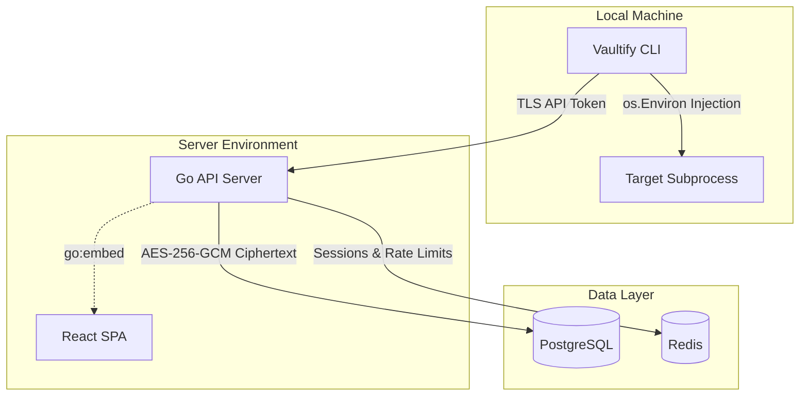

<div align="center">

# Vaultify

[](https://go.dev/)
[](https://react.dev/)
[](https://www.postgresql.org/)
[](https://redis.io/)
[](https://opensource.org/licenses/MIT)

Vaultify is a self-hosted secrets manager built in Go. It stores environment variables and API keys encrypted at rest using AES-256-GCM, and provides a beautiful CLI tool that injects secrets into a subprocess completely in-memory without writing `.env` files to disk.

</div>

---

## ⚡ Core Features

- 🔐 **AES-256-GCM Encryption**: Industry-standard authenticated encryption at rest backed by Argon2id key derivation.
- 🚀 **Zero-Disk CLI Injection**: Injects secrets directly into OS processes via memory, completely eliminating exposed `.env` files.
- 👥 **Role-Based Access Control (RBAC)**: Strict Owner/Member permission boundaries enforced natively via Go middleware.
- 📋 **Tamper-Evident Audit Logging**: Immutable tracking of every secret read, write, and authentication event.
- 📦 **Single-Binary Deployment**: The entire React SPA is compiled directly into the Go binary using the `//go:embed` directive.

## 🚀 Quick Start (CLI Installation)

You can download the raw binaries from the [Releases](#) tab, or use one of our installation scripts to automatically place the `vaultify` executable in your global path.

**Windows (PowerShell):**
```powershell
irm https://raw.githubusercontent.com/0DayMonxrch/vaultify/main/scripts/install.ps1 | iex
```

**Linux / macOS:**
```bash
curl -sSfL https://raw.githubusercontent.com/0DayMonxrch/vaultify/main/scripts/install.sh | bash
```

## 💻 CLI Usage

Once installed, simply type `vaultify` in your terminal to see the beautiful ASCII greeting and help menu!

### 1. Authenticate
Log in using an API token generated from your Vaultify Dashboard. If you don't specify a host, it defaults to `https://try-vaultify.tech`.
```bash
vaultify login --token vt_1234567890abcdef
```

### 2. View Projects & Secrets
```bash
vaultify projects list
vaultify secrets list --project <project_slug> --env development
```

### 3. Run Your Application
Inject secrets directly into any subprocess. For example, to run a Node.js server:
```bash
vaultify run --project <project_slug> --env development -- node server.js
```

---

## 🏗️ Visual Architecture



## 🧠 Architecture Deep Dives

<details>
<summary><b>How the Cryptography Works</b></summary>
<br>

Vaultify employs **Argon2id** and **AES-256-GCM** to enforce strict encryption at rest.

Every project generates a cryptographically secure 32-byte salt upon creation, which is stored in the database. When a secret is accessed or written, the system derives a unique encryption key by combining the project's salt with a system-level `MASTER_KEY` via the Argon2id Key Derivation Function. 

> **NOTE:** The `MASTER_KEY` is strictly an environment variable and is never written to disk. If lost, all encrypted secrets are mathematically unrecoverable.

The derived key is used to encrypt the plaintext secret using AES-256-GCM. Only the ciphertext and a random 12-byte nonce are stored in PostgreSQL. If an attacker successfully dumps the database, they retrieve mathematically useless ciphertext, as decryption is impossible without the off-disk `MASTER_KEY`. Post-decryption, plaintext values are zeroed from memory.
</details>

<details>
<summary><b>How the CLI Injection Works</b></summary>
<br>

The core value proposition of the Vaultify CLI is entirely eliminating `.env` files from developer machines. It achieves this using the POSIX `fork-exec` model.

When executing `vaultify run -- <cmd>`, the CLI fetches the decrypted secrets into memory and constructs a slice of strings formatted as `KEY=VALUE`. Using Go's `os/exec` package, the CLI prepares the target subprocess and explicitly sets its environment state: `cmd.Env = append(os.Environ(), secrets...)`. 

The target application is executed as a child process, inheriting the secrets directly from the OS kernel. The secrets never touch the disk. While Go's garbage collector limitations prevent deterministic zeroing of immutable string types in memory, this approach ensures that volatile credentials leave no permanent filesystem footprint.
</details>

---

## 🛠️ Local Server Setup

Want to self-host or contribute to the backend? You can spin up the full Vaultify stack locally:

```bash
# 1. Start the PostgreSQL and Redis containers in the background
make dev

# 2. Run the database migrations
make migrate

# 3. Compile the embedded SPA and start the API server
make build && ./server.exe
```
